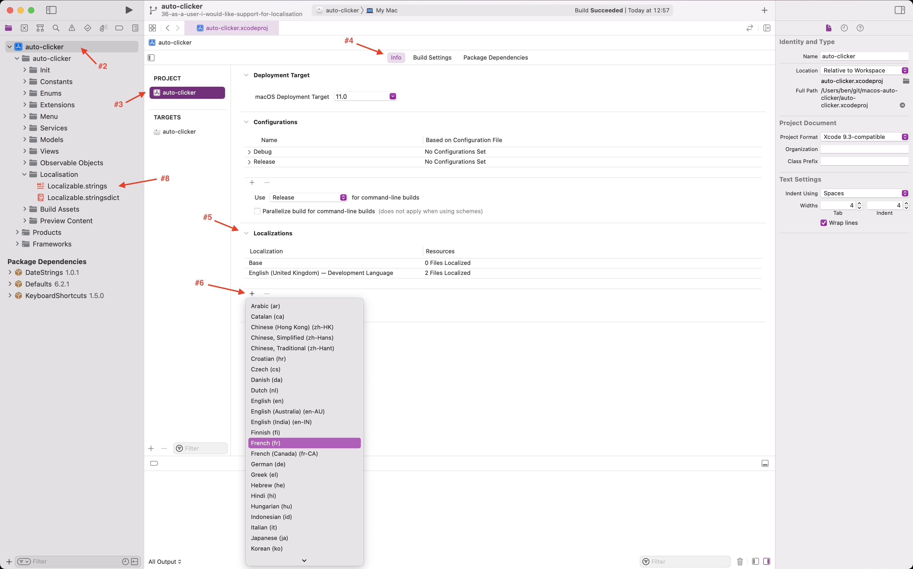

# :mouse: Welcome to the macOS Auto Clicker app's contributing guide

Thank you for taking the time to contribute to our project!

The idea of this guide is to provide you with a reference as to how this repo is maintained and as such, how certain actions should be performed to ensure everyone can contribute against a known workflow.

This may not as of yet be a complete guide and changes will be made as the project/repo progresses to best suit the project/repo and all those involved.

# :notebook_with_decorative_cover: Table of Contents

- [Issue Strategy](#mailbox_with_mail-issue-strategy)
- [Project Setup](#gift-project-setup)
- [Branching Strategy](#seedling-branching-strategy) <!-- NEXT LINE (having it there messes up formatting): - [Running Tests](#test_tube-running-tests) -->
- [Localisation Strategy](#speech_balloon-localisation-strategy)
- [Commit Strategy](#memo-commit-strategy)
- [PR Strategy](#leftwards_arrow_with_hook-pr-strategy)
- [Build Strategy](#wrench-builds)

# :mailbox_with_mail: Issue Strategy

All development should have a related issue to track and reference development being performed, with this being mentioned in the subsequent PR once development is complete.

Issues should ideally follow a [user story structure](https://www.atlassian.com/agile/project-management/user-stories), with the aim of making associated test writing for the issues features|bugs|etc. easier (when they are eventually implemented). The example structure that these should follow goes a little something like:

> As a [persona], I [want to], [so that].

This so that issues can easily be broken down into who, what and why to best assess; feasability, usability, desirability and ultimately deliverables.

In reality though, any issue that is well presented and described should be fine. The semantics can be ironed out later!

Assignees and Labels should be set appropriately. The Project should be set to 'macOS Auto Clicker'. The Milestone can be left blank if whats being developed is being developed as a standalone 'thing', however should the development be part of a larger bundle of 'things' (an [Epic](https://www.atlassian.com/agile/project-management/epics)), it should be set to the overarching theme of the development; for an example of this see the existing [Ease of Installation](https://github.com/othyn/macos-auto-clicker/milestone/9) or [Advanced Mode](https://github.com/othyn/macos-auto-clicker/milestone/8) project Milestones (Epics), in which they also have detailed descriptions on what they aim to accomplish. Feel free to make use of GitHub's 'Create a branch for this issue or link a pull request.' feature under the 'Development' section on the issue sidebar to quickly and easily create the required development branch for this issue, making sure to base it from the `dev` branch.

# :gift: Project Setup

- Clone the repo locally to somewhere you prefer on your machine.
- Navigate into the repo directory on the terminal or open in your favourite editor/IDE.
- Run `make setup` to setup some of the projects dependencies, such as the pre-commit githooks to check for valid commit messages.
- **Make sure you open the project in Xcode via the `auto-clicker.xcworkspace` Workspace.**
- Remember to install the Swift package dependencies once you've opened it for the first time too.
- Build and run through Xcode as you normally would to a macOS target.
  - As a note, the build 'number' will automatically be set to the latest short commit hash when the application is built.

This is a side project, so feel free to submit a PR for any functionality/bug fixes.

Code style is handled by `swiftlint` (`$ brew install swiftlint`) and should automatically fix the style upon build. There is a [GitHub Action](.github/workflows/swiftlint.yml) setup to run on all code submitted, so it can't be avoided!

# :seedling: Branching Strategy

The main project branches are;

- `main`
  - Holds the 'source of truth' for the current (newest) release version detailed in the [releases page](https://github.com/othyn/macos-auto-clicker/releases).
  - The only branch that should be PR'd into `main` is `staging`.
  - The [GitHub Actions CI/CD workflow](.github/workflows/cicd.yml) will kick in when this branch is pushed to and kick off a new build and release (should one be deemed required, see the [Commit Strategy](#memo-commit-strategy) section below for more details).
- `staging`
  - Holds the 'source of truth' for the current beta release version detailed in the [releases page](https://github.com/othyn/macos-auto-clicker/releases).
  - The [GitHub Actions CI/CD workflow](.github/workflows/cicd.yml) will kick in when this branch is pushed to and kick off a new beta build and release (should one be deemed required, see the [Commit Strategy](#memo-commit-strategy) section below for more details)
- `dev`
  - Any development against the project should reside in its own development branch using the `dev` branch as its base, later being PR'd back into `dev` when development is completed.

# :speech_balloon: Localisation Strategy

This project supports localisation! Please see the pinned [language support issue](https://github.com/othyn/macos-auto-clicker/issues/10) as a discussion place for new language support. See the [`auto-clicker/Localisation`](https://github.com/othyn/macos-auto-clicker/tree/main/auto-clicker/Localisation) project directory to view currently supported languages, the project default being `en-GB`.

The project makes use of the Apple default `Localizable.strings` and `Localizable.stringsdict` to support local translations. See [issue #36](https://github.com/othyn/macos-auto-clicker/issues/36) for some useful links and resources for implementing translations. The short tutorial is;

0. Clone this project locally to somewhere on your machine.
1. Open up the project **workspace** in Xcode.
2. Click on the top level project item in the project file browser sidebar in Xcode.
3. Click on the project under the Project heading.
4. Click on the 'Info' tab.
5. Scroll down to 'Localizations'.
6. Click the plus button at the bottom of the table displaying the current project languages and select the language you intend to provide translations for.
7. On the on screen prompt **change nothing** and just click 'Finish'
8. The new language will appear in the `Localisation` folder as a new version of the `Localizable.strings` file, with the language code identifier along with the file and appearing as the parent directory in the `Localisation` folder. E.g. for France this would be `fr`. You will know if the translation file has been picked up by Xcode as the language will appear with the amount of `Localizable.strings` translation files found by Xcode in that 'Localizations' table mentioned in step 5.
9. Once you have written the translations by providing the appropriate new strings in the language you've chosen as are required by the application, please submit a new PR to merge in the new language as a supported language.

<div align=center>
    
</div>

More information on Apple's localisation practices can be found on [their official docs](https://developer.apple.com/localization/), and [their official docs for Xcode](https://developer.apple.com/documentation/xcode/localization). There is also an application, [`mohakapt/Stringz`](https://github.com/mohakapt/Stringz), who's sole intent is to make writing and maintaining language translations easier. See [issue #36](https://github.com/othyn/macos-auto-clicker/issues/36) for some more useful links and resources for implementing translations.

# :memo: Commit Strategy

In order to trigger releases with [Fastlane Semantic Release](https://github.com/xotahal/fastlane-plugin-semantic_release), [conventional commit formatting](https://www.conventionalcommits.org/en/v1.0.0) (more specifically, a subset of the [Angular rules](https://github.com/angular/angular/blob/22b96b9/CONTRIBUTING.md#type) that Fastlane Semantic Release defaults to) **must** be adhered to in order to generate the correct automated changelogs that accompany the release and provide the required keywords so that automated [Semver](https://semver.org/) versioning can triggered.

**PR's will be rejected if the commits are not formatted correctly, so make use of the githook for the repo which can easily be installed by running `make setup`.**

The following are all items that should be prefixed to your commit message to trigger the desired described attached effect, the `*` just representing a wildcard in this example to demonstrate where your actual commit message should reside:

- `feat: *`
  - Triggers: A minor version bump & release
  - Use case: You've implemented a new feature or functionality to the app.
  - Example version bump & release: `1.3.5` > `1.4.0`
  - Example commit: `feat: added awesome new button`
  - Example release title heading: `:star2: Features`
- `fix: *`
  - Triggers: A patch version bump & release
  - Use case: You've fixed a bug within the app.
  - Example version bump & release: `1.4.0` > `1.4.1`
  - Example commit: `fix: fixed crash after awesome new button is pressed`
  - Example release title heading: `:bug: Bug Fixes`
- `refactor: *`
  - Triggers: Nothing
  - Use case: You've refactored part of the project.
  - Example version bump & release: _N/A_
  - Example commit: `refactor: tweaked the awesome buttons action method`
  - Example release title heading: `:recycle: Code Refactoring`
- `perf: *`
  - Triggers: Nothing
  - Use case: You've improved the performance of the project.
  - Example version bump & release: _N/A_
  - Example commit: `perf: improved the CI/CD process speed`
  - Example release title heading: `:rocket: Performance Improvements`
- `chore: *`
  - Triggers: Nothing
  - Use case: You've updated supporting tooling or performed repo maintenance that doesn't require an app release.
  - Example version bump & release: _N/A_
  - Example commit: `chore: implement automated CI/CD process`
  - Example release title heading: `:wrench: Chores`
- `test: *`
  - Triggers: Nothing
  - Use case: You've modified the test suite in some way.
  - Example version bump & release: _N/A_
  - Example commit: `test: improved the test suite`
  - Example release title heading: `:vertical_traffic_light: Testing`
- `docs: *`
  - Triggers: Nothing
  - Use case: You've updated associated documentation for the app.
  - Example version bump & release: _N/A_
  - Example commit: `docs: updated docs to explain the awesome new button`
  - Example release title heading: `:book: Documentation`

_Note: Major versions are not automatically incremented._

# :leftwards_arrow_with_hook: PR Strategy

Any development against the project should reside in its own development branch using the `dev` branch as its base, later being PR'd back into `dev` when development is completed.

There is a [PR template](.github/pull_request_template.md) that will auto populate the PR with required information to fill in. Reviewers, Assignees and Labels should be set appropriately. The Project should be set to 'macOS Auto Clicker'. The Milestone can be left blank if whats being developed is being developed as a standalone 'thing', however should the development be part of a larger bundle of 'things' (an [Epic](https://www.atlassian.com/agile/project-management/epics)), it should be set to the overarching theme of the development; for an example of this see the existing [Ease of Installation](https://github.com/othyn/macos-auto-clicker/milestone/9) or [Advanced Mode](https://github.com/othyn/macos-auto-clicker/milestone/8) project Milestones (Epics), in which they also have detailed descriptions on what they aim to accomplish.

The [GitHub Actions CI/CD workflow](.github/workflows/cicd.yml) will kick in when the `staging` branch is pushed to and kick off a new beta build and release (should one be deemed required, see the [Commit Strategy](#memo-commit-strategy) section above for more details).

# :wrench: Build Strategy

The build process has been automated to provide beta integration builds and production deployment builds, all accessible via the [projects releases page](https://github.com/othyn/macos-auto-clicker/releases).

## App

[Fastlane](https://docs.fastlane.tools/actions/build_mac_app/) handles the builds with automatic `.app` and `.dmg` release targets (can be easily installed via Brew ~ `$ brew install fastlane` for local development testing). This is further automated behind [GitHub Actions](.github/workflows/cicd.yml) to make the process even more fluid and provide automated CI/CD releases onto the [projects releases page](https://github.com/othyn/macos-auto-clicker/releases) for both release (`main` branch) and beta (`staging` branch) builds based on the [Commit Strategy](#memo-commit-strategy).

To locally test the fastlane build, run:

```sh
# Beta release lane (staging branch)
$ fastlane beta

# Production release lane (main branch)
$ fastlane production
```

Which should generate the required `build/Auto Clicker.app`, `build/Auto Clicker.app.dSYM.zip` and `build/Auto Clicker.dmg` build fragments.

## Icon

If the icon is updated in Figma, export the fragments from Figma using the Export option which will export each required size to PNG. Save these into the `art/icon/fragments` folder.

Once done, update the icon images with their relevant size counterpart in Xcode `Build Assets/Assets.xcassets/AppIcon`.
