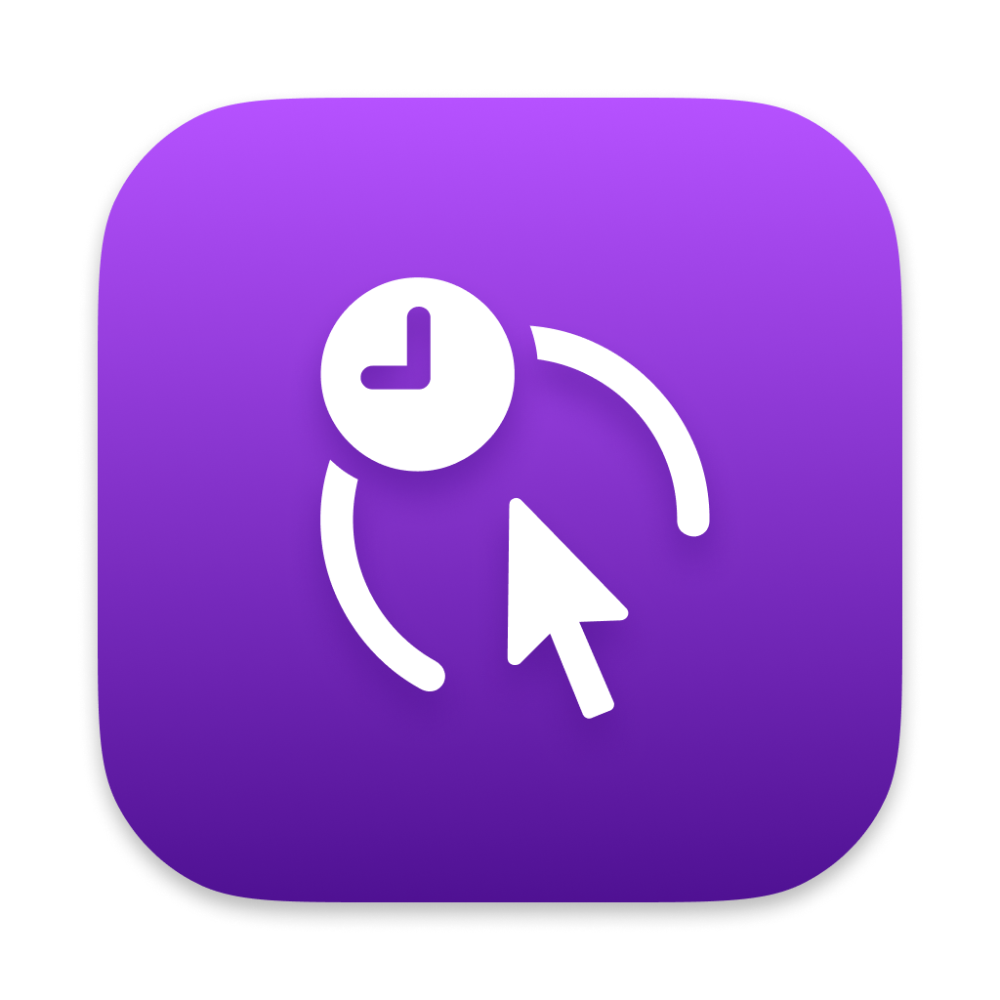
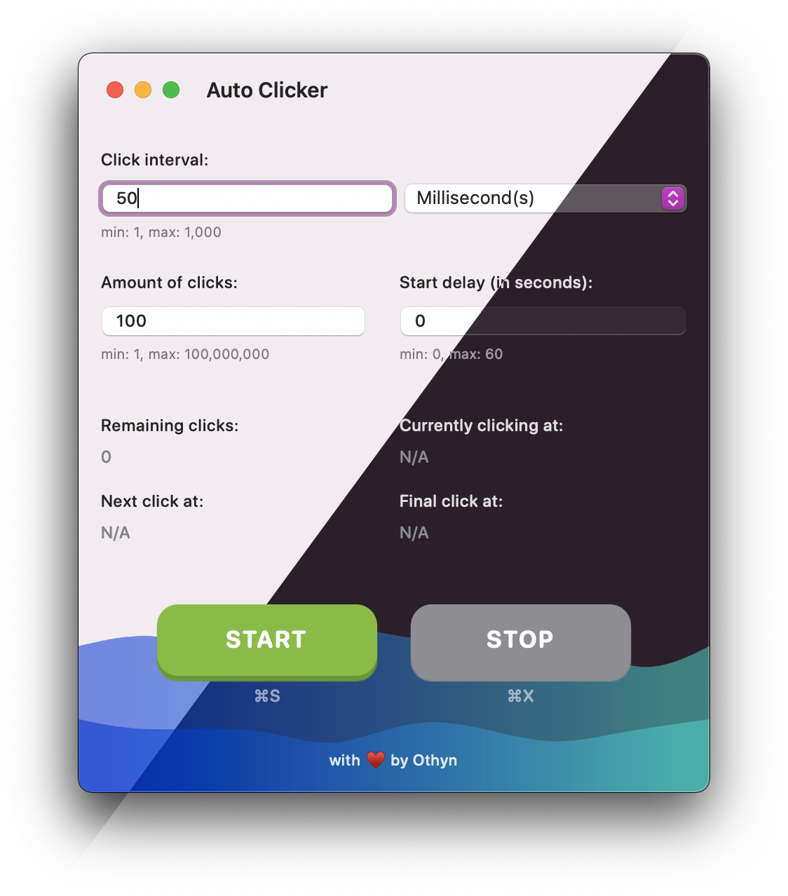

<div align="center">
    
    <h1>Auto Clicker for macOS</h1>
    <p>A simple auto clicker for macOS Big Sur (11), Monterey (12), Ventura (13) and Sonoma (14) built with ♥️ in Swift & SwiftUI.</p>
</div>

<div align="center">
    <p>
        <a href="https://github.com/othyn/macos-auto-clicker/actions/workflows/cicd.yml">
            
        </a>
        <a href="https://github.com/othyn/macos-auto-clicker/actions/workflows/swiftlint.yml">
            
        </a>
        <a href="https://github.com/othyn/macos-auto-clicker/releases">
            
        </a>
        <a href="https://github.com/othyn/macos-auto-clicker/graphs/contributors">
            
        </a>
        <a href="https://github.com/othyn/macos-auto-clicker/network/members">
            
        </a>
        <a href="https://github.com/othyn/macos-auto-clicker/stargazers">
            
        </a>
        <a href="https://github.com/othyn/macos-auto-clicker/issues/">
            
        </a>
        <a href="https://github.com/othyn/macos-auto-clicker/blob/master/LICENSE">
            
        </a>
    </p>
</div>

<div align="center">
    <h4>
        <a href="#floppy_disk-download">Download Latest Version</a>
        <span> · </span>
        <a href="https://github.com/othyn/macos-auto-clicker/issues">Report a Bug</a>
        <span> · </span>
        <a href="https://github.com/othyn/macos-auto-clicker/issues">Request a Feature</a>
    </h4>
</div>

<br />

<!-- Table of Contents -->

# :notebook_with_decorative_cover: Table of Contents

- [About the Project](#star2-about-the-project)
  - [Screenshots](#camera-screenshots)
  - [Tech Stack](#space_invader-tech-stack)
  - [Features](#dart-features)
- [Download](#floppy_disk-download)
  - [Preferences Storage](#gear-preferences-storage)
- [Contributing](#mouse-contributing)
- [Roadmap](https://github.com/users/othyn/projects/1)
- [Changelog](https://github.com/othyn/macos-auto-clicker/releases)
- [License](#warning-license)
- [Acknowledgements](#gem-acknowledgements)

<!-- About the Project -->

## :star2: About the Project

All the auto clickers out there were either really outdated, old, buggy and/or have legacy code bases. This one aims to fix all that giving you flexibility and style. Plus, I get to write in easter eggs, who says love can't be colourful.

<!-- Screenshots -->

### :camera: Screenshots

<div align="center">
    
</div>

<!-- TechStack -->

### :space_invader: Tech Stack

<ul>
    <li>Swift</li>
    <li>Swift UI</li>
    <li>Package: <a href="https://github.com/sindresorhus/KeyboardShortcuts">sindresorhus/KeyboardShortcuts</a></li>
    <li>Package: <a href="https://github.com/sindresorhus/Defaults">sindresorhus/Defaults</a></li>
    <li>Package: <a href="https://github.com/othyn/DateStrings">othyn/DateStrings</a></li>
</ul>

<!-- Features -->

### :dart: Features

- An auto clicker of mouse buttons and presser of keyboard keys!
- Allows for pressing or clicking;
  - ... of any mouse or keyboard button
  - ... at a given interval
  - ... for a given amount of presses per interval
  - ... for a given amount of times
  - ... after a delayed start
- Custom keyboard shortcuts to start and stop the clicking or pressing globally
- Option to keep the window on top for easy access
- Persists all your options between sessions
- Fresh and modern UI/UX
- Lots of colour schemes to suit what ever you prefer

<!-- Download -->

## :floppy_disk: Download

Download for macOS Ventura (13), Sonoma (14) and higher: [v1.7.21](https://github.com/othyn/macos-auto-clicker/releases/download/v1.7.21/AutoClicker.zip)

Download for macOS Big Sur (11) or Monterey (12): [v1.6.1](https://github.com/othyn/macos-auto-clicker/releases/download/v1.6.1/Auto.Clicker.1.6.1.dmg)

**When first using the app, you will need to right click the app and click 'Open', then on the macOS popup window select 'Open' again to trust this version of the app going forward.** This is as at the moment I don't have a paid Apple developer account in order to notarize the app.

**When updating the app, does the permission screen get stuck even though you've given it permission?** There can sometimes be an issue with this, I'm not entirely sure why this occurs, as the bundle identifier for the app remains the same and therefor the granted permissions shouldn't either. MacOS gets 'stuck' thinking the app has permissions when it doesn't and so the permission splash screen for the app will never go away. **To fix it,** click the minus button at the bottom of the list of apps under macOS's Accessibility settings where Auto Clicker is listed to manually remove Auto Clicker from the list of permitted apps. Close Auto Clicker and re-open it and grant it access once again, which should fix the issue. [More detail can be found in the thread for Issue #64](https://github.com/othyn/macos-auto-clicker/issues/64#issuecomment-1615933048).

**For more downloads**, checkout the [releases page](https://github.com/othyn/macos-auto-clicker/releases) for app downloads of any version you want to use, even pre-release builds too.

### :gear: Preferences Storage

The configuration for the app is stored using NSUserDefaults, via the [sindresorhus/Defaults](https://github.com/sindresorhus/Defaults) package, meaning all the applications preferences are stored in the following location:

```txt
~/Library/Preferences/com.othyn.auto-clicker.plist
```

This file can be backed up and/or be used transfer your preferences to other machines, although I'll leave the mechanism for doing so up to you.

If you are looking for ideas on how to achieve this, I often like to use [Symbolic Links (symlink)](https://www.howtogeek.com/297721/how-to-create-and-use-symbolic-links-aka-symlinks-on-a-mac/). By placing the real version of the file in the backup location (in something like a git repo, cloud storage or local/remote storage) and then creating a symlink to the location that the application is expecting, you can safely store the file in the backup location without having to manually move it around or setup auto copy tasks. I accept no responsibility for using this approach, this is for education purposes only, do this at your own risk.

The following commands are an example of how you can achieve this, **making sure to close the app first before doing this to avoid any issues**:

```sh
# Firstly, move the preferences file to the backup location
mv "${HOME}/Library/Preferences/com.othyn.auto-clicker.plist" /path/to/backup/directory/com.othyn.auto-clicker.plist

# Secondly, create a symlink from our backup location to the expected file location for the app
ln -s /path/to/backup/directory/com.othyn.auto-clicker.plist "${HOME}/Library/Preferences/com.othyn.auto-clicker.plist"
```

Note that both paths used **must** be the absolute path to the file, any relative paths won't resolve and the symlink will be created but silently fail as it will be pointed at a path that cannot resolve to the target.

<!-- Contributing -->

## :mouse: Contributing

See the [contribution guide](CONTRIBUTING.md) on how to get started. Thank you for contributing!

Detailed within that guide are steps on how...

- ... issues should be used.
- ... to setup the project.
- ... to contribute new languages via the app's localisation support.
- ... branches should be used.
- ... commits should be formatted.
- ... pull requests should be submitted.
- ... the build process works and the automation that drives it.

_This gold star :star: can be yours if you can figure out why the emoji is a mouse._

<!-- License -->

## :warning: License

Distributed under the MIT License. See [LICENSE](https://github.com/othyn/macos-auto-clicker/blob/main/LICENSE) for more information.

<!-- Acknowledgments -->

## :gem: Acknowledgements

Useful resources and libraries that have been used in the making of this project.

- Readme: [shields.io](https://shields.io/)
- Readme: [ikatyang/emoji-cheat-sheet](https://github.com/ikatyang/emoji-cheat-sheet)
- Readme: [Louis3797/awesome-readme-template](https://github.com/Louis3797/awesome-readme-template)
- Package: [sindresorhus/KeyboardShortcuts](https://github.com/sindresorhus/KeyboardShortcuts)
- Package: [sindresorhus/Defaults](https://github.com/sindresorhus/Defaults)
- Package: [othyn/DateStrings](https://github.com/othyn/DateStrings)

---

_Why a mouse emoji? Auto Clicker > Click with a mouse > Mouse! ... yeah, I know... I know..._
