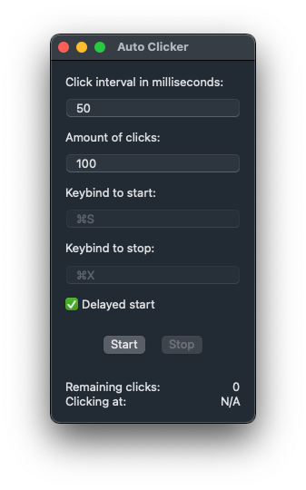

# Auto Clicker for macOS

A simple auto clicker for macOS Big Sur and above, built with ♥️ in Swift 5 & SwiftUI.

    

### Why tho?

All the auto clickers out there were either really outdated, old, buggy and/or have legacy code bases. So, given how simple they are to make, I figured I'd give it a shot, at whipped this up in an evening or two with the aim to make something more modern and maintainable.

---

## Index

-   [Usage](#usage)
-   [Development](#development)
-   [Testing](#testing)
-   [Todo](#todo)
-   [Changelog](#changelog)

---

## Usage

There is a compiled app binary in `dist` ready for use, but at the moment its unsigned as I don't have a paid dev cert, so it may not work for you. If thats the case, clone the project and build a copy using your own dev cert as you would any normal xcode project.

---

## Development

This is a side project, so feel free to submit a PR for any functionality/bug fixes and go ham. There aren't any contributing guidelines or code styles as of yet.

---

## Testing

Hey00000, this needs implementing.

---

## Todo

-   Dev cert from a paid dev account so I can sign the app!
-   Tests
-   Customise keybinds
-   `brew` support
-   'Keep ontop' option
-   Menu bar mode/move app to menu bar popup

---

## Changelog

Any and all project changes for releases should be documented below. Versioning follows the [SEMVER](https://semver.org/) standard.

---

### Version 1.0.0

Initial release.

#### Added

-   Everything

#### Changed

-   Everything

#### Fixed

-   Everything

#### Removed

-   Everything
